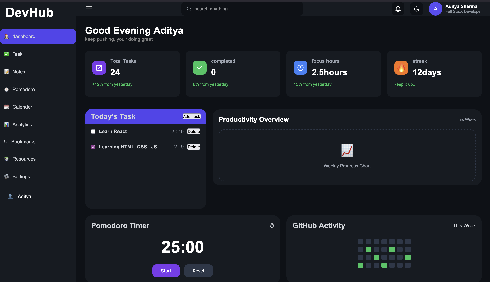

# 🚀 DevHub

DevHub is a Developer Productivity Dashboard that I'm building step by step while learning Full Stack Development.

This project started with HTML & CSS for the UI, and I'm now adding JavaScript features one by one. As I continue learning React, Backend, Databases, and AI, I'll keep upgrading this project.

## 🌐 Live Demo

https://sderadi.github.io/DevHub/

## 📸 Preview

## ✨ Current Features

- Responsive Dashboard UI
- Sidebar Navigation
- Add Task
- Delete Task
- Mark Task as Completed
- Task Counter
- Local Storage Support
- Pomodoro Timer UI
- Productivity Overview Section
- GitHub Activity Section

## 🛠️ Tech Stack

- HTML5
- CSS3
- JavaScript (Vanilla)

## 🚧 Roadmap

### Phase 1 (Current)
- [x] Responsive Dashboard
- [x] Task Management
- [x] Local Storage

### Phase 2
- [ ] Dark Mode
- [ ] Notes
- [ ] Calendar
- [ ] Analytics
- [ ] Search
- [ ] Charts

### Phase 3
- [ ] React Migration
- [ ] Authentication
- [ ] Backend (Node.js + Express)
- [ ] MongoDB Database

### Phase 4
- [ ] AI Task Suggestions
- [ ] AI Productivity Insights
- [ ] Voice Commands
- [ ] Smart Scheduling

## 👨‍💻 Author

Aditya Sharma